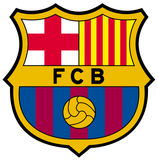
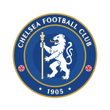

# THE90 — ТЗ: раздел матчей под календарём (главный экран)

**Референс:** видео `FILE 2026-09-09 19:29:25.mp4` — вкладка Matches в OneFootball (0:00–0:20 — сам список, 0:20–0:45 — экран соревнования, вне объёма этой итерации).

**Что берём из референса:** только структуру и композицию списка — секции, группировка по соревнованиям, строка матча, футер группы.
**Чего не берём:** светлую тему, типографику, иконки и цвета OneFootball. Всё собирается на наших токенах (`css/style.css:6-51`) и в нашем тёмном стиле.

Прототип: `index.html` + `css/*` + `js/*`. Ссылки на код — по состоянию ветки `the90` (`0ff2dc9`).

---

## 0. Общие правила

- **Язык UI — только английский.** Русский текст в этом ТЗ — постановка, в код не переносится.
- **Дизайн-система не меняется.** Новые блоки собираем из того, что уже есть:

| Что нужно | Что берём |
|---|---|
| Цвета, радиусы, шрифт | `css/style.css:6-51` (`--brand-primary: #24FF00`, `--bg-surface: #1A1A1A`, `--text-dim`), Sora |
| Поверхность-карточка | приём из `.ccard` (`css/main.css:847-861`): `#1A1A1A` + `outline: 1px solid rgba(255,255,255,.1)` с `outline-offset: -1px` |
| Заголовок секции | `.section-head` (`css/main.css:336-347`) |
| LIVE-плашка и мигающая точка | `.badge` / `.badge__dot` / `@keyframes live-blink` (`css/main.css:261-286`) |
| Логотипы клубов | `T.logo(slug)` → `assets/clubs/<slug>.png` (`js/data.js:33`) |
| Переход на экран | `data-go="<screen>"` (`js/app.js:143-148`) |
| Открытие LIVE-матча | `data-go="live-match"` + `data-live-id="<id>"` (`js/live.js:302-306`) |
| Монограмма вместо отсутствующего лого | приём из `initials()` + `.club-option__logo` (`js/app.js:400-418`) |

- **Технические конвенции:** ванильный ES5-стиль, IIFE, без сборки. Каждый изменённый `.js`/`.css` — бампаем `?v=N` в `index.html:19-30, 2112-2139`.
- **Размер экрана:** 390×852, контентная ширина `.mainscroll__inner` — 390 − 32 = **358px** (`css/main.css:34-40`).

---

## 1. Что сейчас и что меняется

### Сейчас

```
index.html:368-371
  <div class="section-head"><span>Calendar</span></div>
  <div class="daterow" data-daterow></div>
  <div class="daylist" data-daylist></div>
```

Под лентой дат — плоский список из 10 больших карточек `.ccard` (100px, зелёный градиент, «crest — VS — crest», красный ярлык с датой сверху). Рендер: `js/main.js:443-466`. Стили: `css/main.css:839-925`, `.daylist` — `css/main.css:1068`.

Проблемы: 10 карточек по 100px = 1080px вертикали на один день, матчи не сгруппированы по соревнованиям, нет приоритета «мои клубы / мои соревнования», карточка некликабельна и никуда не ведёт.

### Становится

Лента дат остаётся (и прилипает к топбару). Под ней — сгруппированный список в три секции:

```
┌─ topbar (fixed) ────────────────────────────┐
│  Calendar                                    │  .section-head — не трогаем
│  [Mar 8 Sat][Mar 9 Today][Mar 10 Mon]  …     │  .daterow — становится sticky
├──────────────────────────────────────────────┤
│  ★  Followed Matches                         │  секция 1 — только если непусто
│  ┌────────────────────────────────────────┐  │
│  │ 🛡 Real Betis            21:00      ★  │  │
│  │ 🛡 Real Madrid                          │  │
│  └────────────────────────────────────────┘  │
│                                              │
│     Followed Competitions                    │  секция 2 — только если непусто
│  ┌────────────────────────────────────────┐  │
│  │ 🏆 LaLiga                           ★  │  │  шапка группы
│  │    Matchday 4                           │  │
│  ├────────────────────────────────────────┤  │
│  │ 🛡 Real Betis            21:00      ★  │  │  строка матча
│  │ 🛡 Real Madrid                          │  │
│  ├────────────────────────────────────────┤  │
│  │ 🛡 Barcelona           2 – 1        ★  │  │  строка матча (LIVE)
│  │ 🛡 Chelsea             ● 67’            │  │
│  ├────────────────────────────────────────┤  │
│  │             Show all (5)  ›             │  │  футер группы
│  └────────────────────────────────────────┘  │
│                                              │
│     All Matches                              │  секция 3
│     Competitions you don't follow             │
│  ┌ Premier League · Matchday 3 ───────────┐  │
│  …                                           │
├──────────────────────────────────────────────┤
│  News                                        │  не трогаем
```

**Удаляется полностью:** компонент `.ccard` (разметка в `js/main.js:443-466`, стили `css/main.css:839-925`) и `.daylist` (`css/main.css:1068`). Класс `.ccard` больше нигде в проекте не используется — проверить `grep -rn "ccard" .` перед удалением.

---

## 2. Модель данных

### 2.1 Справочник соревнований — новое, `js/data.js`

Сейчас у матча есть только код лиги (`LEAGUE_OF`, `js/data.js:25-29`) — строка `'LAL' | 'APL' | 'BUN' | 'UCL'`. Нужен справочник с названием, страной, логотипом и порядком сортировки:

```js
var COMPETITIONS = {
  UCL: { id:'UCL', name:'UEFA Champions League', short:'UCL', country:'Europe',  order:1, rounds:8  },
  APL: { id:'APL', name:'Premier League',        short:'APL', country:'England', order:2, rounds:38 },
  LAL: { id:'LAL', name:'LaLiga',                short:'LAL', country:'Spain',   order:3, rounds:38 },
  BUN: { id:'BUN', name:'Bundesliga',            short:'BUN', country:'Germany', order:4, rounds:34 }
};

function competition(id) { return COMPETITIONS[id]; }
function competitionLogo(id) { return 'assets/competitions/' + id.toLowerCase() + '.png'; }
```

Экспортировать из `window.THE90`: `COMPETITIONS`, `competition`, `competitionLogo`.

### 2.2 Матч — расширение полей в `buildDay()` (`js/data.js:135-160`)

К существующим `id / home / away / league / kickoff` добавляем:

| Поле | Тип | Как считается |
|---|---|---|
| `competition` | `'LAL'` … | переименование существующего `league` (`js/data.js:156`). У сгенерированных фикстур это поле сейчас никто не читает — проверено, переименовывается без последствий. **Внимание:** у `LIVE_MATCHES` поле `league` — это человекочитаемое имя (`'La Liga'`), его читает `js/live.js:165`; там `league` не трогаем, а рядом добавляем `competition: 'LAL'` |
| `matchday` | `number` | детерминированно от даты: номер недели от 1 августа текущего сезона, `1 + (weeksSinceSeasonStart % comp.rounds)`. Один и тот же день → всегда один и тот же номер тура |
| `status` | `'upcoming' \| 'live' \| 'finished'` | прошедшие дни (`isPast`) → `finished`; сегодняшние матчи из `LIVE_MATCHES` → `live`; остальное → `upcoming` |
| `score` | `{home, away}` или `null` | для `finished` — детерминированный счёт из уже существующей модели: берём `seeded(m.id)` (`js/data.js:122-129`) и разыгрываем сетку `grid(m)` (`js/data.js:56-65`), выбирая счёт по накопленной вероятности. Никакого нового `Math.random()` |

### 2.3 Слияние с LIVE_MATCHES

`LIVE_MATCHES` (`js/data.js:195-270`) сейчас живут отдельно от календаря. Для **сегодняшнего** дня:

- если сгенерированный матч дня повторяет пару из `LIVE_MATCHES` (в любом порядке) — он **заменяется** live-версией (сохраняются `id` live-матча, `scoreHome/scoreAway`, `minute`);
- если такой пары в дне нет — live-матч **добавляется** в свою группу соревнования;
- внутри группы live-матчи идут первыми, дальше — по времени начала.

Соревнование live-матчей берётся из `LEAGUE_OF` по домашнему клубу: `live-1` → LAL, `live-2` → APL, `live-3` → BUN.

### 2.4 Подписки — новый модуль `js/follows.js`

Сейчас выбор любимых клубов на онбординге (`js/app.js:385-440`) никуда не сохраняется — массив `selectedClubs` умирает вместе с сессией. Заводим общее хранилище:

```js
// window.THE90.follows
{
  clubs(),                 // ['real-madrid', …]
  competitions(),          // ['LAL', …]
  matches(),               // ['2026-9-9-3', …]
  isClub(slug), isCompetition(id), isMatch(id),
  toggleClub(slug), toggleCompetition(id), toggleMatch(id),   // → новое состояние (bool)
  setClubs(list)
}
```

- Ключ в `localStorage`: `the90:follows`, значение `{ clubs: [], competitions: [], matches: [] }`.
- Чтение/запись — через `try/catch`, как в остальных модулях (`js/avatars.js:32-38`).
- **Дефолт при первом запуске:** `{ clubs: [], competitions: ['LAL'], matches: [] }` — чтобы секция «Followed Competitions» на чистой установке не была пустой.
- Любое изменение диспатчит `document.dispatchEvent(new CustomEvent('the90:follows'))`.
- **Онбординг подключаем к хранилищу:** в `js/app.js` при клике `[data-team-continue]` пишем выбранные клубы через `follows.setClubs()` (имена из `PROFILE_CLUBS` мапим в слаги — у записей с `null` в первом поле слага нет, они игнорируются). При открытии экрана `teams` — предзаполняем `selectedClubs` из хранилища.
- Сброс прототипа по клику на логотип (`js/app.js:135-140`, `localStorage.clear()`) возвращает подписки к дефолту — отдельной обработки не нужно.

---

## 3. Разметка

Контейнер `[data-daylist]` сохраняем как точку монтирования, но переименовываем в `[data-fixtures]` с классом `.fixtures`:

```html
<!-- Calendar -->
<div class="section-head"><span>Calendar</span></div>
<div class="daterow" data-daterow></div>
<div class="fixtures" data-fixtures></div>
```

Всё внутри `.fixtures` рендерится из JS. Итоговая структура одной секции:

```html
<section class="fxsec">
  <div class="fxsec__head">
    
    <span class="fxsec__title">Followed Matches</span>
  </div>
  <!-- одна или несколько групп -->
</section>
```

Секция «All Matches» — с подзаголовком:

```html
<div class="fxsec__head fxsec__head--stacked">
  <span class="fxsec__title">All Matches</span>
  <small class="fxsec__sub">Competitions you don't follow</small>
</div>
```

Группа соревнования:

```html
<article class="fxgroup" data-competition="LAL">
  <header class="fxgroup__head">
    
    <span class="fxgroup__copy">
      <b class="fxgroup__name">LaLiga</b>
      <small class="fxgroup__round">Matchday 4</small>
    </span>
    <button class="fxstar is-on" type="button" data-follow-competition="LAL"
            aria-pressed="true" aria-label="Unfollow LaLiga">
      
    </button>
  </header>

  <!-- строки матчей -->

  <button class="fxgroup__more" type="button" data-group-more aria-expanded="false">
    Show all (5) 
  </button>
</article>
```

Группа в секции «Followed Matches» идёт **без шапки** — только строки (`.fxgroup--flat`).

Строка матча:

```html
<div class="fxrow fxrow--live" data-match-id="live-1" data-go="live-match" data-live-id="live-1"
     role="button" tabindex="0"
     aria-label="Barcelona versus Chelsea, live, 2–1, 67 minutes. Open the match">
  <span class="fxrow__teams">
    <span class="fxrow__team">
      
      <span class="fxrow__name">Barcelona</span>
    </span>
    <span class="fxrow__team">
      
      <span class="fxrow__name">Chelsea</span>
    </span>
  </span>

  <span class="fxrow__state">
    <b class="fxrow__score">2 – 1</b>
    <span class="fxrow__minute"><i class="fxrow__dot"></i>67’</span>
  </span>

  <button class="fxstar" type="button" data-follow-match="live-1"
          aria-pressed="false" aria-label="Follow Barcelona versus Chelsea">
    
  </button>
</div>
```

Варианты `.fxrow__state`:

| Статус | Содержимое |
|---|---|
| `upcoming` | `<b class="fxrow__time">21:00</b>` + при сделанном пике `<small class="fxrow__pick">2 – 1</small>` |
| `live` | `<b class="fxrow__score">2 – 1</b>` + `<span class="fxrow__minute">● 67’</span>` |
| `finished` | `<b class="fxrow__score">2 – 1</b>` + `<small class="fxrow__ft">FT</small>` |

Пустое состояние дня:

```html
<div class="fxempty">
  <b>No matches on this day</b>
  <small>Pick another date to see the fixtures</small>
</div>
```

---

## 4. Стили — новый файл `css/fixtures.css`

Подключить в `index.html` рядом с остальными (`index.html:19-30`), после `main.css`.

### 4.1 Лента дат становится липкой

```css
.daterow {
  position: sticky;
  top: var(--topbar-h);           /* 126px, css/main.css:14 */
  z-index: 5;
  background: var(--bg-primary);  /* иначе строки просвечивают под лентой */
  padding: 6px 16px 8px;          /* было 0 16px 2px */
}
```

`.section-head` с «Calendar» остаётся нелипким и уезжает вверх — так же, как в референсе уезжает заголовок экрана.

### 4.2 Секция

```css
.fixtures      { display: flex; flex-direction: column; gap: 20px; }
.fxsec         { display: flex; flex-direction: column; gap: 8px; }
.fxsec__head   { display: flex; align-items: center; gap: 8px; padding: 0 8px; }
.fxsec__head--stacked { flex-direction: column; align-items: flex-start; gap: 2px; }
.fxsec__icon   { opacity: .9; }
.fxsec__title  { font-size: 12px; font-weight: 600; line-height: 18px; color: var(--text-primary); }
.fxsec__sub    { font-size: 11px; font-weight: 400; line-height: 16px; color: var(--text-dim); }
```

### 4.3 Группа

```css
.fxgroup {
  background: var(--bg-surface);
  border-radius: 24px;
  outline: 1px solid rgba(255,255,255,.1);
  outline-offset: -1px;          /* тот же приём, что и в .ccard: рамка не двигает содержимое */
  overflow: hidden;
}

.fxgroup__head { display: flex; align-items: center; gap: 12px; padding: 12px 12px 12px 16px; min-height: 60px; }
.fxgroup__logo { width: 28px; height: 28px; object-fit: contain; flex: none; }
.fxgroup__copy { display: flex; flex-direction: column; gap: 2px; min-width: 1px; flex: 1 0 0; }
.fxgroup__name { font-size: 14px; font-weight: 600; line-height: 20px; color: #fff;
                 overflow: hidden; text-overflow: ellipsis; white-space: nowrap; }
.fxgroup__round{ font-size: 11px; font-weight: 400; line-height: 16px; color: var(--text-dim); }
```

Монограмма при отсутствующем логотипе — `<span class="fxgroup__logo fxgroup__logo--mono">LAL</span>`: тот же квадрат 28×28, `border-radius: 8px`, `background: #272727`, `font-size: 9px; font-weight: 700; color: var(--text-muted)`, центрирование по обеим осям.

### 4.4 Строка матча

```css
.fxrow {
  position: relative;
  display: grid;
  grid-template-columns: 1fr 68px 40px;
  align-items: center;
  gap: 8px;
  min-height: 68px;
  padding: 10px 8px 10px 16px;
  transition: background-color .18s ease;
}
/* разделитель, вжатый по бокам — как в референсе */
.fxrow::before {
  content: '';
  position: absolute; top: 0; left: 16px; right: 16px; height: 1px;
  background: rgba(255,255,255,.08);
}
.fxgroup--flat .fxrow:first-child::before { display: none; }
.fxrow[role="button"]:active { background: #232323; }   /* та же реакция, что у .datecell:hover */

.fxrow__teams { display: flex; flex-direction: column; gap: 6px; min-width: 1px; }
.fxrow__team  { display: flex; align-items: center; gap: 10px; min-width: 1px; }
.fxrow__crest { width: 20px; height: 20px; object-fit: contain; flex: none; }
.fxrow__name  { font-size: 13px; font-weight: 500; line-height: 18px; color: #fff;
                overflow: hidden; text-overflow: ellipsis; white-space: nowrap; }

.fxrow__state {
  position: relative;
  display: flex; flex-direction: column; align-items: center; justify-content: center; gap: 2px;
  height: 100%;
}
.fxrow__state::before {                 /* вертикальный отбойник слева от времени */
  content: '';
  position: absolute; left: -8px; top: 50%; transform: translateY(-50%);
  width: 1px; height: 32px; background: rgba(255,255,255,.1);
}
.fxrow__time,
.fxrow__score { font-size: 14px; font-weight: 600; line-height: 20px; color: #fff; white-space: nowrap; }
.fxrow__ft    { font-size: 10px; font-weight: 500; line-height: 14px; color: var(--text-dim); letter-spacing: .5px; }
.fxrow__pick  { font-size: 10px; font-weight: 600; line-height: 14px; color: var(--brand-primary); white-space: nowrap; }

/* LIVE — минута и точка на брендовом зелёном, анимация переиспользуется */
.fxrow__minute { display: flex; align-items: center; gap: 4px;
                 font-size: 11px; font-weight: 600; line-height: 16px; color: var(--brand-primary); }
.fxrow__dot    { width: 4px; height: 4px; border-radius: 2px; background: var(--brand-primary);
                 animation: live-blink 1.4s steps(1, end) infinite; }   /* css/main.css:278 */
.fxrow--finished .fxrow__name,
.fxrow--finished .fxrow__crest { opacity: .65; }
```

### 4.5 Звезда

```css
.fxstar {
  width: 40px; height: 40px;
  display: flex; align-items: center; justify-content: center;
  border-radius: 12px;
  opacity: .35;                     /* неактивная — приглушённый контур */
  transition: opacity .18s ease, transform .12s ease;
}
.fxstar.is-on   { opacity: 1; }
.fxstar:active  { transform: scale(.9); }
```

Активная звезда — файл `star-fill.svg`, залитый `--brand-primary`; неактивная — `star.svg`, контур `#FFFFFF`. Оба — 20×20 внутри кнопки 40×40 (тап-таргет ≥ 40px).

### 4.6 Футер группы

```css
.fxgroup__more {
  position: relative;
  width: 100%;
  min-height: 44px;
  display: flex; align-items: center; justify-content: center; gap: 6px;
  font-size: 12px; font-weight: 600; line-height: 18px;
  color: var(--brand-primary);
}
.fxgroup__more::before {
  content: '';
  position: absolute; top: 0; left: 16px; right: 16px; height: 1px;
  background: rgba(255,255,255,.08);
}
.fxgroup__more img { transition: transform .18s ease; }
.fxgroup__more[aria-expanded="true"] img { transform: rotate(90deg); }   /* › → ⌄ */
```

### 4.7 Пустое состояние

```css
.fxempty {
  display: flex; flex-direction: column; align-items: center; gap: 4px;
  padding: 28px 16px;
  background: var(--bg-surface);
  border-radius: 24px;
  outline: 1px solid rgba(255,255,255,.1);
  outline-offset: -1px;
  text-align: center;
}
.fxempty b     { font-size: 13px; font-weight: 600; color: #fff; }
.fxempty small { font-size: 11px; color: var(--text-dim); }
```

---

## 5. Сборка списка — `js/main.js`, вместо строк 443-466

`renderCalendar()` разделяется на две функции: `renderDateRow()` (существующий код 414-441, без изменений) и `renderFixtures()` (новая). Обе вызываются при выборе дня и при событии `the90:follows`.

Порядок сборки для выбранного дня:

1. **`Followed Matches`** — матчи дня, для которых `follows.isMatch(m.id) || follows.isClub(m.home) || follows.isClub(m.away)`. Плоский список в одной `.fxgroup--flat`, сортировка: live → по `kickoff` → finished. Секция скрывается целиком, если список пуст.
2. **`Followed Competitions`** — соревнования, встречающиеся в этом дне, у которых `follows.isCompetition(id)`. Сортировка групп по `COMPETITIONS[id].order`. Секция скрывается целиком, если таких нет.
3. **`All Matches`** — все остальные соревнования дня, та же сортировка. Подзаголовок `Competitions you don't follow` показывается **только если** секция 2 непуста; иначе у секции остаётся один заголовок.

**Дубли разрешены.** Матч любимого клуба показывается и в «Followed Matches», и внутри своей группы ниже — ровно как в референсе (0:03 и 0:51: Real Betis — Real Madrid в обоих местах). Состояние звезды у дублей синхронно, потому что после каждого переключения список перерисовывается целиком.

**Сворачивание группы.** В группе по умолчанию видно **3 строки**. Если матчей больше — снизу футер `Show all (N) ›`, по тапу разворачивает все, надпись меняется на `Show less`, `aria-expanded="true"`. Состояние «развёрнута» хранится в памяти модуля по ключу `секция + competition` и сбрасывается при смене дня. В «Followed Matches» лимит не применяется — там всё сразу.

Перерисовка целиком (`replaceChildren`) — списка максимум ~13 строк, оптимизация не нужна.

---

## 6. Интеракции

| Элемент | Действие |
|---|---|
| Строка, `status === 'live'` | `data-go="live-match"` + `data-live-id` → экран LIVE. Уже работает через `js/live.js:302-306`, ничего дописывать не нужно |
| Строка сегодняшнего дня, `status === 'upcoming'` | диспатчим `the90:open-pick` с `{ id }`. `js/main.js` слушает: находит индекс матча в `matches`, вызывает `slideTo(index)` (`js/main.js:186-193`) и скроллит `.mainscroll` к рейлу пиков. Если карточка уже принята — то же самое, карточка откроется в своём состоянии |
| Строка другого дня | не кликабельна: без `role="button"`, без `tabindex`, без `:active`-подсветки |
| `[data-follow-match]` | `follows.toggleMatch(id)`, `stopPropagation()` (иначе сработает переход по строке), перерисовка списка |
| `[data-follow-competition]` | `follows.toggleCompetition(id)` — группа переезжает между «Followed Competitions» и «All Matches» на месте, без перезагрузки экрана |
| `[data-group-more]` | разворот/сворачивание группы |
| Шапка группы | **не кликабельна** в этой итерации: экрана соревнования у нас нет (см. §10) |
| Клавиатура | `Enter` / `Space` на `.fxrow[role="button"]` работают как тап |

Тап по звезде не должен запускать переход по строке — обработчик звезды вешается первым и вызывает `event.stopPropagation()`; глобальный `[data-go]`-делегат в `js/app.js:143` до него не дойдёт.

---

## 7. Ассеты

| Файл | Что это | Примечание |
|---|---|---|
| `assets/icons/star.svg` | контур звезды, `stroke: #FFFFFF`, 20×20 | новый |
| `assets/icons/star-fill.svg` | залитая звезда, `fill: #24FF00`, 20×20 | новый |
| `assets/icons/chevron-right.svg` | шеврон вправо, 14×14 | новый (в проекте есть только `chevron-down.svg`) |
| `assets/competitions/ucl.png` `apl.png` `lal.png` `bun.png` | логотипы соревнований, 96×96, прозрачный фон | новые. До появления файлов работает монограмма (§4.3) — 404 в консоли быть не должно: `onerror` на `` подменяет узел монограммой |

---

## 8. Файлы и объём

| Файл | Что делаем |
|---|---|
| `index.html` | 371: `.daylist[data-daylist]` → `.fixtures[data-fixtures]`. Подключить `css/fixtures.css` и `js/follows.js`. Бампнуть `?v=` для `data.js`, `main.js`, `app.js`, `main.css` |
| `js/data.js` | + `COMPETITIONS`, `competition()`, `competitionLogo()`; `buildDay()` — поля `competition/matchday/status/score`; слияние с `LIVE_MATCHES`; экспорт |
| `js/follows.js` | **новый.** Хранилище подписок + событие `the90:follows` |
| `js/app.js` | Онбординг клубов пишет и читает `follows` (385-440) |
| `js/main.js` | 443-466 удалить; добавить `renderFixtures()`, слушатель `the90:follows`, обработчик `the90:open-pick` |
| `css/main.css` | Удалить `.ccard*` (839-925) и `.daylist` (1068). `.daterow` — sticky (1030-1039) |
| `css/fixtures.css` | **новый.** Всё из §4.2-4.7 |

Оценка: 1.5–2 дня разработки + 0.5 дня на иконки и логотипы соревнований.

---

## 9. Критерии приёмки

1. Под лентой дат нет ни одной карточки `.ccard`; `grep -rn "ccard" .` не находит ничего, кроме истории git.
2. При скролле главного экрана лента дат прилипает под топбаром, строки матчей уходят под неё, не просвечивая.
3. Матчи дня сгруппированы по соревнованиям; порядок секций — `Followed Matches` → `Followed Competitions` → `All Matches`; порядок групп внутри секции — UCL, APL, LaLiga, Bundesliga.
4. Тап по звезде в шапке группы переносит группу между секциями 2 и 3 без перезагрузки экрана; состояние переживает переключение дня и перезагрузку страницы.
5. Тап по звезде в строке матча добавляет матч в `Followed Matches`; матч виден одновременно и там, и в своей группе, обе звезды активны.
6. Матч, у которого один из клубов выбран на онбординге, попадает в `Followed Matches` без ручного тапа по звезде.
7. LIVE-матч в списке показывает счёт и мигающую минуту брендовым зелёным; тап открывает экран LIVE именно этого матча.
8. Тап по матчу сегодняшнего дня прокручивает рейл пиков к карточке этого матча.
9. Прошедший день: все матчи со счётом и меткой `FT`; счёт стабилен между перезагрузками.
10. Группа с пятью и более матчами показывает три строки и `Show all (N)`; после разворота — `Show less`, шеврон повёрнут.
11. День без матчей — карточка `No matches on this day`.
12. Нет горизонтального скролла на 390×852, нет ошибок в консоли, нет 404 по ассетам.
13. Все звёзды — `<button>` с `aria-pressed` и осмысленным `aria-label`; кликабельные строки достижимы с клавиатуры.

---

## 10. Вне объёма этой итерации

Помечаю явно, чтобы не всплыло при приёмке:

- **`See Table ›` в футере группы** (0:05 на видео). Требует турнирной таблицы, а у нас в справочнике 8 клубов на 4 соревнования — в LaLiga окажется две команды. Сначала расширяем `CLUBS` до ~20 клубов с логотипами (имена уже есть в `PROFILE_CLUBS`, `js/app.js:385-393`), потом делаем таблицу. В этой итерации в футере — `Show all (N)`.
- **Экран соревнования** (0:20–0:45: вкладки Matchday / Table / Official / Transfers / News / Stats). Отдельная большая задача, шапка группы поэтому некликабельна.
- **Экран матча для не-LIVE фикстур** (0:40 на видео: Overview / Preview / Line-up / Predictions). У нас его роль играет карточка пика — на неё и ведём.
- **Фильтр в правом верхнем углу** (иконка настроек на видео). У нас топбар занят балансом и уведомлениями.
